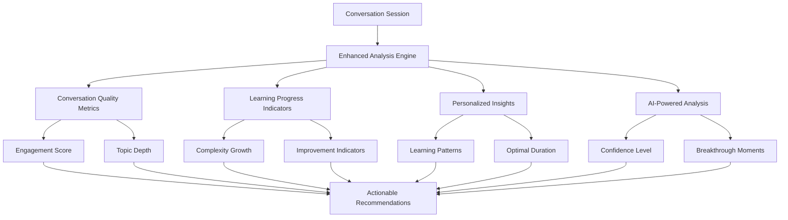

# Enhanced Tutor Analysis System

## Overview

The Enhanced Tutor Analysis System is a comprehensive AI-powered feature that provides deep insights into user conversation sessions beyond the basic summary. This system analyzes conversation quality, learning progress, personalized patterns, and provides actionable recommendations to significantly increase user engagement and learning outcomes.

## Current vs Enhanced Analysis

### Current Analysis (Basic)
- **Topic**: The conversation topic
- **Duration**: Length of conversation in minutes
- **Message Count**: Number of messages exchanged
- **Summary**: AI-generated 1-2 sentence summary

### Enhanced Analysis (New)
- **Conversation Quality Metrics**: Engagement score, topic depth analysis
- **Learning Progress Indicators**: Complexity growth, improvement patterns
- **Personalized Insights**: Learning patterns, optimal session characteristics
- **AI-Powered Analysis**: Confidence levels, breakthrough moments, struggle points
- **Actionable Recommendations**: Immediate actions, weekly focus areas, long-term goals

## Architecture

The enhanced analysis system consists of several integrated components:



## Core Analysis Components

### 1. Conversation Quality Metrics

#### Engagement Score (0-100)
Measures how actively the user participated in the conversation:

- **Word Count Analysis**: Average words per message (max 40 points)
- **Question Asking**: Number of questions asked by user (max 30 points)
- **Elaboration Rate**: Percentage of detailed responses (max 30 points)

**Feedback Examples**:
- 80+: "Excellent engagement! You actively participated with detailed responses and questions."
- 60-79: "Good engagement! Try asking more questions to deepen the conversation."
- 40-59: "Moderate engagement. Consider giving more detailed responses."
- <40: "Low engagement. Try to elaborate more on your answers and ask follow-up questions."

#### Topic Depth Analysis
Analyzes how thoroughly the conversation explored the chosen topic:

- **Keyword Usage**: Topic-specific vocabulary utilization
- **Depth Score**: Calculated based on relevant terminology
- **Coverage Assessment**: How well the topic was explored

**Topic Keywords Database**:
- **Travel**: trip, journey, vacation, country, city, culture, experience, visit
- **Food**: eat, taste, cook, recipe, restaurant, meal, flavor, dish
- **Work**: job, career, office, colleague, project, meeting, business
- **Hobbies**: enjoy, fun, interest, passion, activity, leisure, free time
- **Family**: parent, sibling, relative, child, mother, father, family
- **Education**: school, study, learn, teacher, student, university, course

### 2. Learning Progress Indicators

#### Complexity Growth Analysis
Compares current session complexity with previous sessions:

- **Sentence Complexity Scoring**: Word count + subordinate clauses + complex structures
- **Trend Analysis**: Improving, stable, or declining patterns
- **Historical Comparison**: Against user's previous 5 sessions

**Complexity Calculation**:
```python
def calculate_complexity(sentence):
    word_score = min(len(words) * 0.5, 10)  # Max 10 points
    clause_score = sentence.count(',') * 2   # Commas indicate complexity
    complex_score = count_complex_words(['because', 'although', 'however']) * 2
    return word_score + clause_score + complex_score
```

#### Improvement Indicators
- **Vocabulary Diversity**: Unique words / total words ratio
- **Response Length Trend**: Increasing, stable, or decreasing
- **Question Asking Behavior**: Frequency of user questions
- **Average Response Length**: Statistical analysis of message lengths

### 3. Personalized Insights

#### Learning Pattern Detection
Analyzes user behavior across multiple sessions:

- **Topic Preferences**: Which topics generate most engagement
- **Optimal Duration**: User's most effective session lengths
- **Engagement Patterns**: When user performs best
- **Improvement Areas**: Specific areas needing attention

**Pattern Analysis**:
- **Preferred Topics**: Calculated by engagement score (duration × 0.6 + messages × 0.4)
- **Session Efficiency**: Messages per minute ratio
- **Consistency Tracking**: Regular vs. irregular practice impact

#### Improvement Area Identification
- **Session Length**: If average < 3 minutes
- **Conversation Participation**: If average messages < 10
- **Topic Variety**: If user explores < 3 different topics

### 4. AI-Powered Insights

#### Advanced Analysis Using GPT-4o
The system uses OpenAI's GPT-4o to provide sophisticated insights:

```python
prompt = f"""
Analyze this {language} language learning conversation at {level} level about {topic}.
Duration: {duration_minutes} minutes.

Provide insights in JSON format with these keys:
- confidence_level: How confident the student seemed (0-100)
- breakthrough_moments: Array of specific moments where student excelled
- struggle_points: Array of specific areas where student struggled
- vocabulary_highlights: New or advanced words the student used successfully
- grammar_patterns: Grammar structures the student attempted
- cultural_awareness: Evidence of cultural understanding in responses
- motivation_indicators: Signs of high or low motivation
- next_session_focus: Specific recommendations for the next practice session
"""
```

#### AI Analysis Components
- **Confidence Level**: Detected through speech patterns and response length
- **Breakthrough Moments**: Specific instances of successful language use
- **Struggle Points**: Areas where user had difficulty
- **Vocabulary Highlights**: Advanced or new words used correctly
- **Grammar Patterns**: Structures attempted (successful and unsuccessful)
- **Cultural Awareness**: Evidence of cultural understanding
- **Motivation Indicators**: Signs of engagement or frustration

### 5. Actionable Recommendations

#### Three-Tier Recommendation System

**Immediate Actions** (Next Session):
- "Try to give longer, more detailed responses in your next session"
- "Ask follow-up questions to keep the conversation flowing"
- "Challenge yourself with more complex sentence structures"

**Weekly Focus** (This Week):
- "Study vocabulary related to [topic]"
- "Practice describing experiences in more detail"
- "Practice using connecting words like 'because', 'although', 'however'"

**Long-Term Goals** (Ongoing):
- "Set a goal to practice 3-4 times per week"
- "Focus on areas you find most challenging"
- "Explore different conversation topics"

## Implementation Details

### Backend Architecture

#### Enhanced Analysis Engine (`enhanced_analysis.py`)
```python
async def generate_enhanced_analysis(
    messages: List[ConversationMessage],
    user_id: str,
    language: str,
    level: str,
    topic: str,
    duration_minutes: float
) -> Dict[str, Any]:
    """Generate comprehensive enhanced analysis for a conversation session"""
    
    # 1. Conversation Quality Metrics
    engagement = ConversationQualityMetrics.calculate_engagement_score(messages)
    topic_depth = ConversationQualityMetrics.analyze_topic_depth(messages, topic)
    
    # 2. Learning Progress Indicators
    complexity_analysis = await LearningProgressIndicators.analyze_complexity_growth(user_id, messages)
    
    # 3. Personalized Insights
    learning_patterns = await PersonalizedInsights.detect_learning_patterns(user_id, session_data)
    
    # 4. AI-powered insights using OpenAI
    ai_insights = await _generate_ai_insights(messages, language, level, topic, duration_minutes)
    
    # 5. Compile comprehensive analysis
    return {
        "conversation_quality": {
            "engagement": engagement,
            "topic_depth": topic_depth,
            "overall_score": (engagement["score"] + topic_depth["score"]) / 2
        },
        "learning_progress": {
            "complexity_growth": complexity_analysis,
            "improvement_indicators": improvement_indicators
        },
        "personalized_insights": learning_patterns,
        "ai_insights": ai_insights,
        "recommendations": recommendations,
        "generated_at": datetime.utcnow().isoformat()
    }
```

#### Database Integration
The enhanced analysis is stored in the `conversation_sessions` collection:

```javascript
{
  "_id": ObjectId("..."),
  "user_id": "...",
  "language": "english",
  "level": "B2",
  "topic": "travel",
  "messages": [...],
  "duration_minutes": 5.2,
  "message_count": 18,
  "summary": "The student discussed travel experiences...",
  "enhanced_analysis": {
    "conversation_quality": {
      "engagement": {
        "score": 78.5,
        "feedback": "Good engagement! Try asking more questions...",
        "details": {
          "avg_words_per_message": 12.3,
          "questions_asked": 3,
          "elaboration_rate": 72.2
        }
      },
      "topic_depth": {
        "score": 60,
        "feedback": "Good coverage of travel. Try to use more specific vocabulary...",
        "details": {
          "topic_keywords_used": 6,
          "keywords_found": ["trip", "journey", "experience", "culture", "visit", "country"]
        }
      },
      "overall_score": 69.3
    },
    "learning_progress": {
      "complexity_growth": {
        "score": 15.2,
        "trend": "improving",
        "improvement": 2.3,
        "feedback": "Excellent! Your sentence complexity has improved..."
      },
      "improvement_indicators": {
        "vocabulary_diversity": 0.654,
        "total_unique_words": 45,
        "response_length_trend": "increasing",
        "questions_asked": 3,
        "average_response_length": 12.3
      }
    },
    "personalized_insights": {
      "patterns": {
        "preferred_topics": {
          "most_engaging": "travel",
          "engagement_score": 8.7
        },
        "optimal_duration": {
          "optimal_duration": 5.8,
          "efficiency_score": 3.2,
          "recommendation": "Your 5.8-minute sessions are well-paced. Keep it up!"
        }
      },
      "feedback": "You're most engaged when discussing travel. Your 5.8-minute sessions are well-paced."
    },
    "ai_insights": {
      "confidence_level": 75,
      "breakthrough_moments": [
        "Successfully used past perfect tense when describing previous trips",
        "Demonstrated cultural awareness when discussing local customs"
      ],
      "struggle_points": [
        "Hesitation with conditional structures",
        "Limited use of travel-specific vocabulary"
      ],
      "vocabulary_highlights": ["magnificent", "breathtaking", "immersive"],
      "grammar_patterns": ["past perfect", "comparative adjectives", "conditional (attempted)"],
      "cultural_awareness": "Showed understanding of cultural differences in travel experiences",
      "motivation_indicators": "High engagement, asking follow-up questions",
      "next_session_focus": [
        "Practice conditional structures for hypothetical travel scenarios",
        "Expand travel vocabulary with specific terms"
      ]
    },
    "recommendations": {
      "immediate_actions": [
        "Practice using conditional structures in your next session",
        "Try to incorporate more travel-specific vocabulary"
      ],
      "weekly_focus": [
        "Study advanced travel vocabulary",
        "Practice describing hypothetical situations"
      ],
      "long_term_goals": [
        "Aim for consistent 5-7 minute sessions",
        "Explore cultural topics in different languages"
      ]
    },
    "generated_at": "2025-01-06T20:15:00.000Z"
  },
  "is_streak_eligible": true,
  "created_at": "2025-01-06T20:10:00.000Z",
  "updated_at": "2025-01-06T20:15:00.000Z"
}
```

### API Endpoints

#### Save Conversation with Enhanced Analysis
```
POST /api/progress/save-conversation
```
Automatically generates and saves enhanced analysis when a conversation is saved.

#### Get Enhanced Analysis
```
GET /api/progress/conversation/{session_id}/analysis
```
Retrieves the enhanced analysis for a specific conversation session. If no analysis exists, it generates one on-demand.

**Response Example**:
```json
{
  "session_id": "60a1b2c3d4e5f6789012345",
  "enhanced_analysis": {
    "conversation_quality": { ... },
    "learning_progress": { ... },
    "personalized_insights": { ... },
    "ai_insights": { ... },
    "recommendations": { ... }
  },
  "session_info": {
    "language": "english",
    "level": "B2",
    "topic": "travel",
    "duration_minutes": 5.2,
    "message_count": 18,
    "created_at": "2025-01-06T20:10:00.000Z"
  }
}
```

## User Experience Impact

### Enhanced Engagement Features

#### 1. **Detailed Progress Visualization**
- **Engagement Trends**: Visual charts showing engagement scores over time
- **Complexity Growth**: Graphs displaying language complexity improvement
- **Topic Mastery**: Progress bars for different conversation topics

#### 2. **Personalized Learning Insights**
- **Learning Style Detection**: Recommendations based on user patterns
- **Optimal Practice Times**: When user performs best
- **Topic Preferences**: Which subjects generate most engagement

#### 3. **Gamification Elements**
- **Achievement Unlocks**: Based on enhanced analysis metrics
- **Progress Milestones**: Complexity growth achievements
- **Engagement Badges**: For high participation scores

#### 4. **Smart Recommendations**
- **Adaptive Difficulty**: Suggestions based on current performance
- **Personalized Content**: Topics and exercises tailored to user interests
- **Learning Path Optimization**: Recommendations for next steps

### Frontend Integration Ideas

#### Enhanced Profile Dashboard
```typescript
// Enhanced conversation history display
{conversationHistory.map((session) => (
  <ConversationCard key={session.id}>
    <BasicInfo>
      <Language>{session.language}</Language>
      <Level>{session.level}</Level>
      <Topic>{session.topic}</Topic>
      <Duration>{session.duration_minutes} min</Duration>
    </BasicInfo>
    
    <EnhancedMetrics>
      <EngagementScore score={session.enhanced_analysis?.conversation_quality?.engagement?.score} />
      <ComplexityTrend trend={session.enhanced_analysis?.learning_progress?.complexity_growth?.trend} />
      <TopicDepth score={session.enhanced_analysis?.conversation_quality?.topic_depth?.score} />
    </EnhancedMetrics>
    
    <AIInsights>
      <ConfidenceLevel level={session.enhanced_analysis?.ai_insights?.confidence_level} />
      <BreakthroughMoments moments={session.enhanced_analysis?.ai_insights?.breakthrough_moments} />
      <NextFocus items={session.enhanced_analysis?.ai_insights?.next_session_focus} />
    </AIInsights>
    
    <Recommendations>
      <ImmediateActions actions={session.enhanced_analysis?.recommendations?.immediate_actions} />
      <WeeklyFocus focus={session.enhanced_analysis?.recommendations?.weekly_focus} />
    </Recommendations>
  </ConversationCard>
))}
```

#### Progress Analytics Page
- **Engagement Timeline**: Chart showing engagement scores over time
- **Complexity Growth Graph**: Visual representation of language complexity improvement
- **Topic Mastery Radar**: Spider chart showing proficiency across different topics
- **Learning Patterns**: Insights into optimal practice times and preferences

#### Smart Recommendations Widget
- **Daily Suggestions**: Based on recent performance and patterns
- **Weekly Goals**: Automatically generated based on analysis
- **Challenge Mode**: Adaptive difficulty based on current skill level

## Benefits for Different User Types

### For Practice Mode Users
- **Real-time Feedback**: Immediate insights after each conversation
- **Progress Tracking**: Detailed metrics showing improvement over time
- **Personalized Recommendations**: Tailored suggestions for next practice sessions
- **Motivation Boost**: Recognition of breakthrough moments and achievements

### For Assessment → Speaking Users
- **Comprehensive Analysis**: Beyond basic CEFR scoring
- **Learning Path Guidance**: Specific recommendations for skill development
- **Weakness Identification**: Precise areas needing improvement
- **Strength Recognition**: Acknowledgment of successful language use

### For Learning Plan Integration
- **Adaptive Content**: Recommendations that feed into learning plan creation
- **Progress Milestones**: Clear markers for advancement
- **Skill Gap Analysis**: Identification of areas needing focus
- **Personalized Curriculum**: Learning paths based on individual patterns

## Performance Considerations

### Optimization Strategies

#### 1. **Asynchronous Processing**
- Enhanced analysis runs in background during conversation saving
- Non-blocking operations to maintain responsive user experience
- Fallback to basic analysis if enhanced analysis fails

#### 2. **Caching and Storage**
- Analysis results stored in database for quick retrieval
- On-demand generation for historical sessions without analysis
- Efficient data structures for complex analysis data

#### 3. **API Rate Limiting**
- Intelligent use of OpenAI API calls
- Batch processing for multiple analysis requests
- Fallback mechanisms for API failures

#### 4. **Progressive Enhancement**
- Basic functionality works without enhanced analysis
- Enhanced features load progressively
- Graceful degradation for older sessions

## Future Enhancements

### Planned Features

#### 1. **Advanced Analytics**
- **Sentiment Analysis**: Emotional state during conversations
- **Learning Velocity**: Rate of improvement over time
- **Predictive Modeling**: Forecasting user progress and challenges

#### 2. **Social Features**
- **Peer Comparison**: Anonymous benchmarking against similar learners
- **Study Groups**: Collaborative learning based on analysis insights
- **Mentor Matching**: Pairing users with complementary strengths/weaknesses

#### 3. **Integration Enhancements**
- **Calendar Integration**: Optimal practice time recommendations
- **Learning Management Systems**: Export analysis data to external platforms
- **Mobile App**: Enhanced analysis on mobile devices

#### 4. **AI Model Improvements**
- **Custom Language Models**: Trained specifically for language learning analysis
- **Multi-modal Analysis**: Integration of audio analysis for pronunciation insights
- **Real-time Analysis**: Live feedback during conversations

## Technical Implementation Notes

### Error Handling
- Comprehensive fallback mechanisms for analysis failures
- Graceful degradation to basic summary if enhanced analysis unavailable
- Detailed logging for debugging and improvement

### Security Considerations
- User data privacy in AI analysis
- Secure storage of conversation content
- Compliance with data protection regulations

### Scalability
- Efficient database queries for large user bases
- Optimized analysis algorithms for performance
- Horizontal scaling capabilities for analysis processing

## Conclusion

The Enhanced Tutor Analysis System represents a significant advancement in language learning technology, providing users with deep, actionable insights into their conversation practice. By combining multiple analysis techniques with AI-powered insights, the system creates a highly engaging and personalized learning experience that adapts to each user's unique patterns and needs.

This comprehensive analysis goes far beyond basic conversation summaries, offering users a clear path for improvement and recognition of their progress, ultimately leading to increased engagement, motivation, and learning outcomes.
